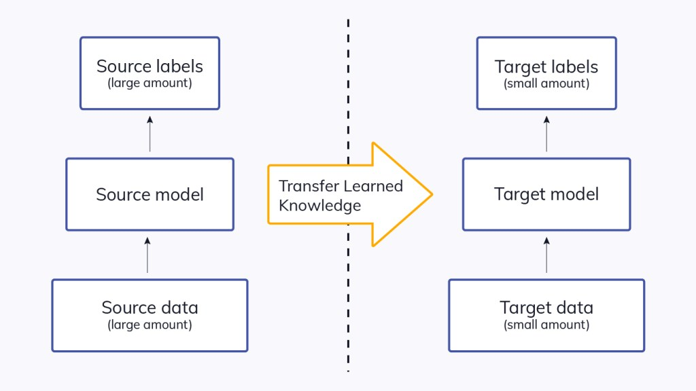
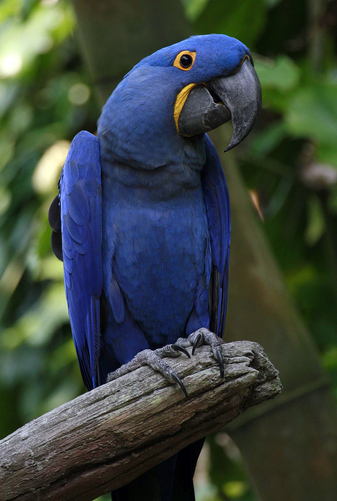
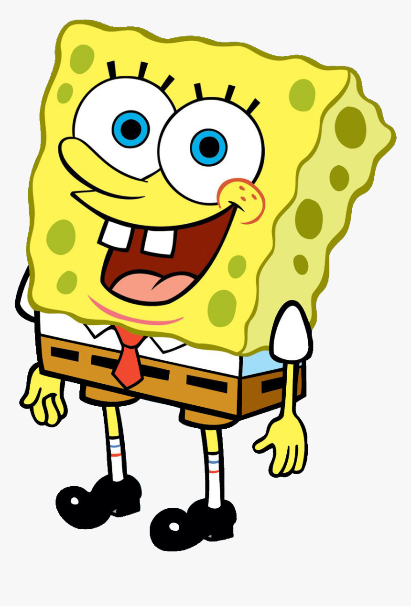

# Transfer Learning for Image Classifiction  
  
**Transfer learning** is about leveraging feature representations from a pre-trained model, so you don’t have to train a new model from scratch. These models can be used directly in making predictions on new tasks or integrated into the process of training a new model. Including the pre-trained models in a new model leads to **lower training time and lower generalization error**. there are two big reasons why you want to use transfer learning:  
**1-** training models with high accuracy requires a lot of data. For example, the ImageNet dataset contains over 1 million images. In the real world, **you are unlikely to have such a large dataset**.  
**2-** assuming that you had that kind of dataset, you might still not have the resources required to train a model on such a large dataset. Hence transfer learning makes a lot of sense **if you don’t have the compute resources needed** to train models on huge datasets.  
**3-** even if you had the compute resources at your disposal, **you still have to wait for days or weeks to train such a model**. Therefore using a pre-trained model will save you precious time.  

   
  

   
**Note**: Transfer learning will not work when the high-level features learned by the bottom layers are not sufficient to differentiate the classes in your problem. In such cases, we have to remove some layers from the pre-trained model. As a result, we will face overfitting because removing layers reduces the number of trainable parameters, which can result in overfitting. Furthermore, determining the correct number of layers to remove without overfitting is a cumbersome and time-consuming process. Solution for this kind of issues is Fine tuning, retraining the model/part of it using a low learning rate which prevents significant updates to the gradient and using a callback to stop the training process when the model has stopped improving.  

## Application of Transfer Learning for image classification ( ResNet50, VGG16, VGG19 )  

I used the ImageNet weight to find the classes of some images by VGG16 & ResNet50.   
for the macaw image, both have the same first predicted class as 'Macaw' and the two next classes are different.   

   
    

   
for the Tiger image, both have the same first 3 predicated classes but the probability of VGG16 is higher.  

   
    

   
Just for fun, you can see their result on Bob sponge image :D   

   
  

   

Note: for VGG19, I faced this error :  
"`decode_predictions` expects a batch of predictions (i.e. a 2D array of shape (samples, 1000)). Found array with shape: (1, 14, 14, 512)"   
Later, I will come back to check it!

